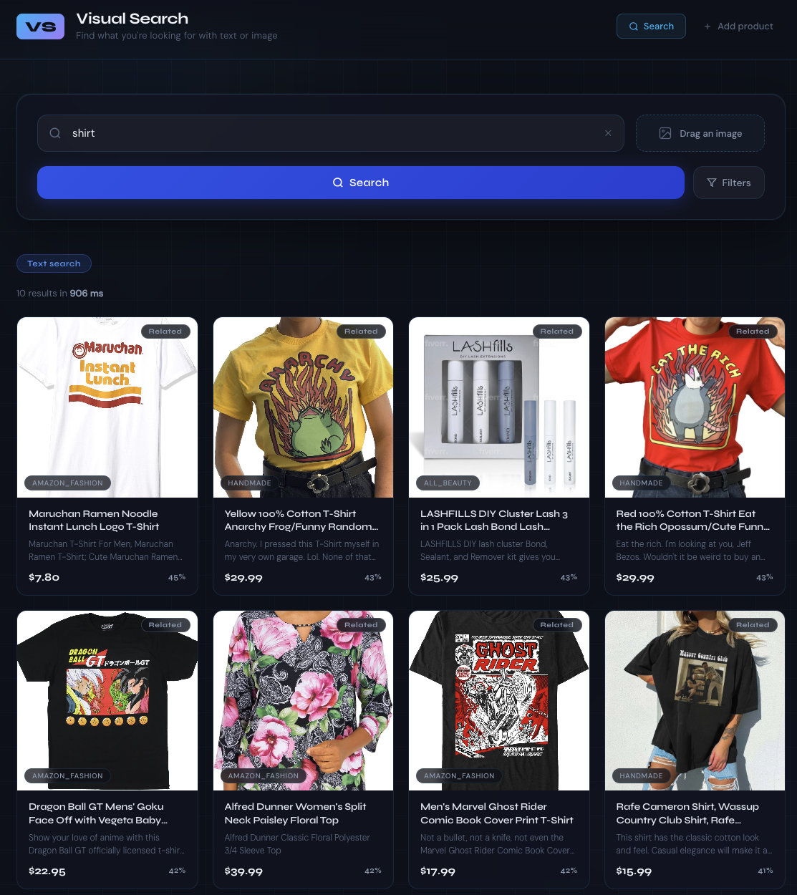

# Visual Search E-Commerce Engine


> Search products by text, image, or both — powered by Google's first natively multimodal embedding model.

---

## Screenshot



---

## The Problem

Traditional e-commerce search breaks when customers can't find the right words. A user who sees a red ribbed turtleneck on Instagram shouldn't need to know it's called a "ribbed turtleneck" — they should be able to upload the photo and find it instantly. This engine bridges the gap between how people **think** about products and how they're **described** in catalogs.

---

## Why Gemini Embedding 2 Is the Key Differentiator

Most multimodal search systems use separate models for text and images, then try to align two different vector spaces — which introduces error and complexity.

`gemini-embedding-2-preview` is Google's first **natively multimodal** embedding model:

| Approach                 | Models needed        | Vector spaces       | Cross-modal accuracy   |
| ------------------------ | -------------------- | ------------------- | ---------------------- |
| Traditional (CLIP-style) | 2 (text + vision)    | 2, manually aligned | Degraded at boundaries |
| **This project**         | **1 (Gemini Emb 2)** | **1 unified space** | **Native**             |

- **One model for text + image** — a product's name, description, and photo become a single 3072-dimensional vector
- **No alignment step** — text queries land naturally next to visually similar products
- **Cross-modal search works out of the box** — search with words, find images; search with an image, surface text-described products

---

## Stack

| Layer            | Technology                                                                                             |
| ---------------- | ------------------------------------------------------------------------------------------------------ |
| Embedding model  | [Gemini Embedding 2 Preview](https://ai.google.dev/gemini-api/docs/embeddings) — 3072 dims, multimodal |
| Vector database  | [Qdrant](https://qdrant.tech) — cosine similarity, filter support                                      |
| Backend API      | [FastAPI](https://fastapi.tiangolo.com) — async, auto-docs at `/docs`                                  |
| Frontend         | [React](https://react.dev) + [TypeScript](https://www.typescriptlang.org) + [Vite](https://vitejs.dev) |
| HTTP client      | [httpx](https://www.python-httpx.org) — async-capable, used for image downloads                        |
| Containerization | [Docker Compose](https://docs.docker.com/compose/) — Qdrant only; API runs locally                     |

---

## Setup in 5 Steps

**Prerequisites:** Python 3.11+, Node 18+, Docker, a [Gemini API key](https://aistudio.google.com/app/apikey)

```bash
# 1. Clone
git clone https://github.com/your-username/visual-search-ecommerce.git
cd visual-search-ecommerce

# 2. Start Qdrant
docker compose up -d

# 3. Install backend dependencies
cd backend
python -m venv .venv && source .venv/bin/activate
pip install -r requirements.txt

# 4. Configure environment
cp .env.example .env
# → Edit .env and set GEMINI_API_KEY=your_key_here
#   Optionally set MIN_SCORE_DEFAULT=0.35 to filter low-confidence results

# 5. Index products and start the API
python scripts/index_products.py        # skips already-indexed products
uvicorn src.api:app --reload --port 8000
```

**Frontend (optional):**

```bash
cd frontend
npm install
npm run dev     # dev server at localhost:5173, proxies /api → localhost:8000
```

---

## API Endpoints

### `GET /health`

Liveness + readiness check. Returns Qdrant status and vector count.

```bash
curl http://localhost:8000/health
# {"status":"ok","qdrant":true,"vectors_count":500}
```

### `GET /categories`

Returns all unique categories currently indexed.

```bash
curl http://localhost:8000/categories
# {"categories":["clothing","footwear","bags","accessories"]}
```

### `POST /search/text`

Search by text query.

```bash
curl -X POST http://localhost:8000/search/text \
  -H "Content-Type: application/json" \
  -d '{
    "query": "red cotton t-shirt",
    "limit": 5,
    "min_score": 0.35
  }'
```

Optional filters: `category` (string), `max_price` (float), `min_score` (0.0–1.0).

### `POST /search/image`

Search by uploading an image.

```bash
curl -X POST http://localhost:8000/search/image \
  -F "file=@/path/to/photo.jpg" \
  -F "limit=5" \
  -F "min_score=0.35"
```

### `POST /search/multimodal`

Search with text + image combined (best accuracy).

```bash
curl -X POST http://localhost:8000/search/multimodal \
  -F "query=casual summer top" \
  -F "file=@/path/to/photo.jpg" \
  -F "limit=5"
```

### `POST /products`

Index a new product with optional image.

```bash
curl -X POST http://localhost:8000/products \
  -F "name=Blue Denim Jacket" \
  -F "description=Classic washed denim with button front" \
  -F "category=outerwear" \
  -F "price=129.99" \
  -F "image=@/path/to/jacket.jpg"
```

---

## Project Structure

```
visual-search-ecommerce/
├── docker-compose.yml              # Qdrant container
├── backend/
│   ├── .env.example                # Environment variable template
│   ├── requirements.txt
│   ├── src/
│   │   ├── api.py                  # FastAPI app — all endpoints
│   │   ├── embeddings.py           # GeminiEmbedder — text, image, multimodal
│   │   ├── vector_store.py         # ProductVectorStore — Qdrant wrapper
│   │   └── indexer.py              # ProductIndexer — orchestrates indexing pipeline
│   ├── scripts/
│   │   ├── health_check.py         # Verify Qdrant is reachable
│   │   ├── index_products.py       # CLI: index sample_products.json
│   │   ├── index_fast.py           # Fast indexer: parallel downloads + batch embedding
│   │   ├── load_amazon_dataset.py  # Pull products from HuggingFace Amazon dataset
│   │   └── reset_collection.py     # Drop and recreate the Qdrant collection
│   ├── data/
│   │   ├── sample_products.json    # Product catalog (500 Amazon Fashion items)
│   │   └── image_cache/            # Downloaded images (git-ignored)
│   └── tests/
│       ├── conftest.py             # Fixtures: mock embedder, test Qdrant collection
│       └── test_api.py             # 39 tests across all endpoints
└── frontend/
    ├── src/
    │   ├── components/             # SearchBar, ImageUpload, ProductCard, etc.
    │   └── api/
    │       └── search.ts           # API client — all search calls
    └── vite.config.ts              # Proxies /api → localhost:8000
```

---

## Indexing Cost

Gemini Embedding 2 is billed per 1,000 characters of input.

| Catalog size             | Estimated cost     |
| ------------------------ | ------------------ |
| 10 products (demo)       | ~$0.00 (free tier) |
| 500 products (this repo) | ~$0.03             |
| 1,000 products           | ~$0.07             |
| 50,000 products          | ~$3.25             |

> The `ProductIndexer` class tracks character count and prints an estimated cost after each run.
> Multimodal products (text + image) cost slightly more due to image token count.

---

## What I Learned

### Text vs. Image vs. Multimodal — What Each Modality Buys You

| Search mode                   | Strengths                                                                           | Weaknesses                                                             |
| ----------------------------- | ----------------------------------------------------------------------------------- | ---------------------------------------------------------------------- |
| Text only                     | Works without product images; good for specific attributes ("waterproof", "size M") | Fails when the user can't name what they're looking for                |
| Image only                    | Captures visual similarity — color, shape, texture — without any text               | Ignores intent signals: "vintage style" vs "modern" can look identical |
| **Multimodal (text + image)** | Combines visual similarity with semantic intent                                     | Requires a product image at index time                                 |

**Key insight:** With a unified vector space, a text query like `"cozy winter sweater"` surfaces products that _look_ warm and textured — not just products whose descriptions contain those words. The model has internalized the visual concept of "cozy."

### Similarity Threshold Matters More Than Expected

Without a threshold, every query returns `limit` results — even if the top result scores 0.22 (essentially noise). Setting `MIN_SCORE_DEFAULT=0.35` cut irrelevant results dramatically while keeping genuine matches. Start at 0.3 and tune up based on your catalog.

### Batch Embedding Is a 5–10× Speedup

Sequential embedding (one product per API call) took ~13 minutes for 500 products. The `index_fast.py` script sends 5 products per Gemini call and downloads images in parallel across 8 threads, reducing that to ~2–3 minutes.

---

## Next Steps

- **Re-ranking with a cross-encoder** — use a small BERT model to re-score the top-k ANN results for higher precision
- **Hybrid search (BM25 + vector)** — combine keyword matching with semantic search using Qdrant's sparse+dense fusion; catches exact SKU/brand searches that pure vector search misses
- **Image-derived filters** — extract color, material, and style attributes from product images at index time (via Gemini Vision) and expose them as facets
- **Query expansion** — use an LLM to rewrite vague queries (`"something for a beach wedding"`) into richer embedding inputs
- **Personalization layer** — weight results by user click history stored as a profile vector in Qdrant

---

## License

MIT
